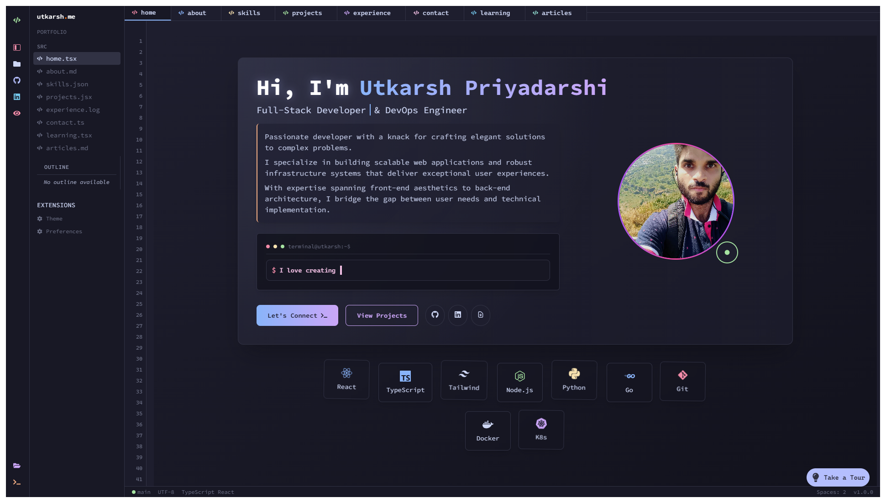
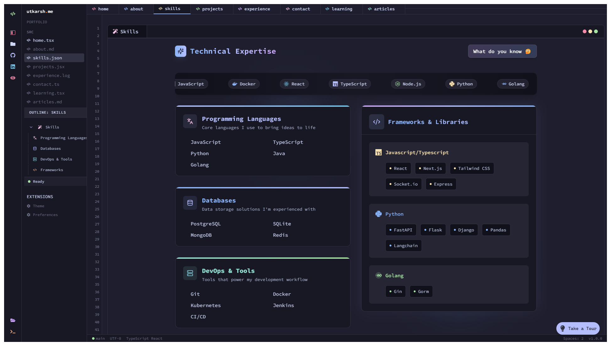
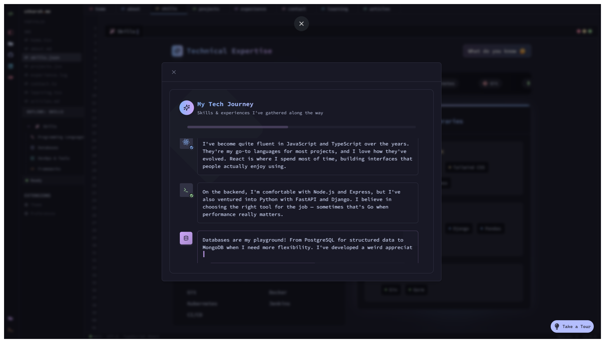
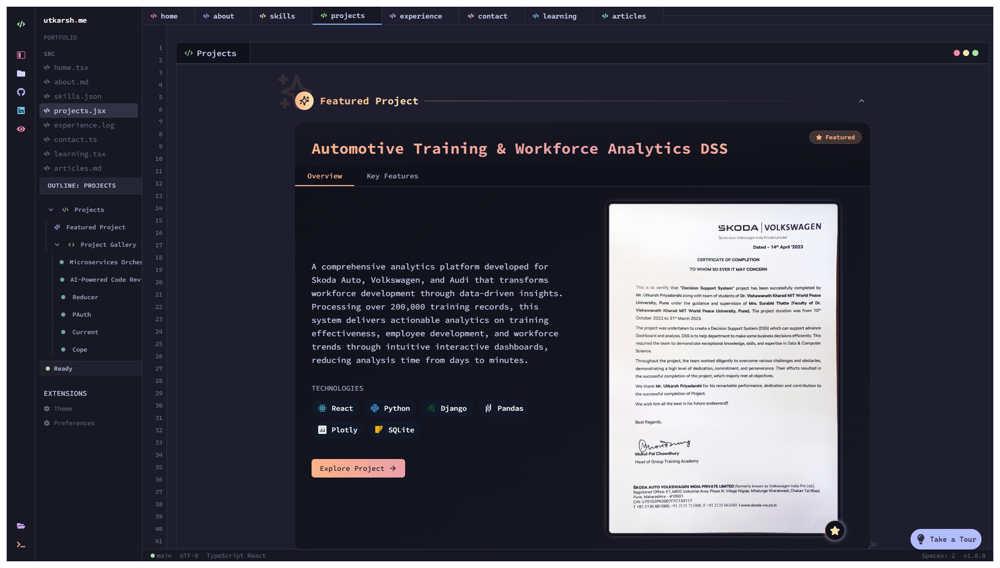
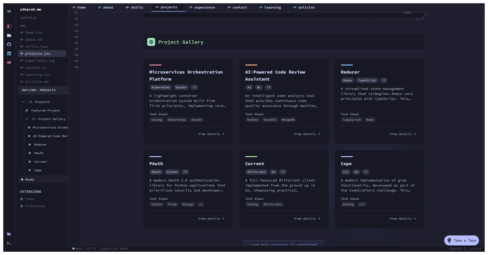

# 🚀 My Portfolio Website

Hi there! Welcome to my portfolio website repository. This is where I showcase my skills, projects, and experiences as a developer. I've built this site using React, TypeScript, and Tailwind CSS to create a clean, interactive, and responsive experience.

🔗 **Check it out live:** [utkarsh5026.github.io/Portfolio](https://utkarsh5026.github.io/)











## ✨ Features

- **VS Code-inspired UI**: I've designed the interface to resemble a code editor, complete with syntax highlighting, tabs, and a file explorer
- **Interactive Components**: The site includes animated sections, a terminal with custom commands, and dynamic project cards
- **Responsive Design**: Works smoothly on devices of all sizes
- **Dark Mode**: Built with the Catppuccin Mocha color palette for a sleek, modern look
- **Performance Optimized**: Lazy loading, code splitting, and memoization for a snappy experience
- **Custom Animations**: Used Framer Motion and AnimeJS for smooth, engaging transitions

## 🛠️ Technology Stack

### Core
- **React 18.3**: For building a component-based UI
- **TypeScript**: For type safety and better development experience
- **Vite**: For fast development and optimized builds
- **Tailwind CSS**: For utility-first styling

### UI Components
- **shadcn/ui**: For accessible and customizable UI components
- **Radix UI**: For headless UI primitives
- **Lucide Icons & React Icons**: For a comprehensive icon library

### Animations
- **Framer Motion**: For declarative animations and gestures
- **AnimeJS**: For complex timeline-based animations

### State Management
- **React Context API**: For global state management
- **Custom Hooks**: For reusable state logic

## 🏗️ Project Structure

```
src/
├── components/         # UI components
│   ├── base/           # Base components like ThemeProvider
│   ├── home/           # Main section components
│   │   ├── about/      # About me section
│   │   ├── articles/   # Articles section
│   │   ├── contact/    # Contact section
│   │   ├── editor/     # Code editor components
│   │   ├── intro/      # Introduction section
│   │   ├── learning/   # Current learning section
│   │   ├── projects/   # Projects showcase
│   │   ├── skills/     # Skills section
│   │   └── work/       # Work experience section
│   ├── section/        # Section layout components
│   ├── ui/             # shadcn/ui components
│   └── utils/          # Utility components
├── lib/                # Utility functions
├── types/              # TypeScript type definitions
└── App.tsx             # Main application component
```

## 🚀 Getting Started

To run this project locally:

1. Clone the repository
   ```bash
   git clone https://github.com/yourusername/portfolio.git
   cd portfolio
   ```

2. Install dependencies
   ```bash
   npm install
   ```

3. Start the development server
   ```bash
   npm run dev
   ```

4. Open your browser and visit `http://localhost:5173`

## 📱 Features

### Terminal Integration
I've built a custom terminal that supports various commands to navigate through the portfolio. Try these commands:
- `help` - Show available commands
- `about` - Learn more about me
- `projects` - View my projects
- `skills` - See my technical skills
- `contact` - Get my contact information

### Interactive Project Cards
Each project card includes:
- Project description
- Technologies used
- Key features
- Links to GitHub and live demos

### Editor Experience
The VS Code-inspired interface includes:
- File explorer
- Tabs for different sections
- Draggable tabs for rearranging content
- Status bar with section information
- Terminal toggling with Ctrl+`

## 🌐 Deployment

The site is deployed on GitHub Pages and can be accessed at [utkarsh5026.github.io](https://utkarsh5026.github.io/).

## 🛠️ Building for Production

To build the project for production:

```bash
npm run build
```

This will generate optimized files in the `dist` directory ready for deployment.

## 🧪 Future Improvements

- Add more interactive features to the terminal
- Integrate a blog section with my technical articles
- Add light/dark theme toggle
- Implement i18n for multiple languages
- Add more projects and case studies

## 📝 License

This project is open source and available under the MIT License.

## 📞 Contact

Feel free to reach out to me:
- Email: utkarshpriyadarshi5026@gmail.com
- GitHub: [utkarsh5026](https://github.com/utkarsh5026)
- LinkedIn: [Utkarsh Priyadarshi](https://www.linkedin.com/in/utkarsh-priyadarshi-8b5a731b9/)
- Twitter: [@UtkarshPriyad10](https://x.com/UtkarshPriyad10)

---

Thank you for checking out my portfolio! I'm constantly working to improve it and add new features. If you have any suggestions or feedback, please don't hesitate to reach out. 😊