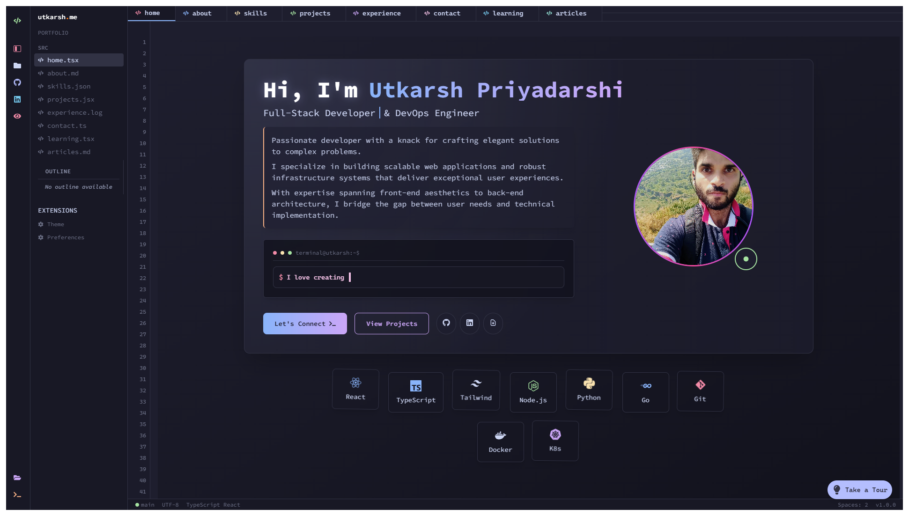
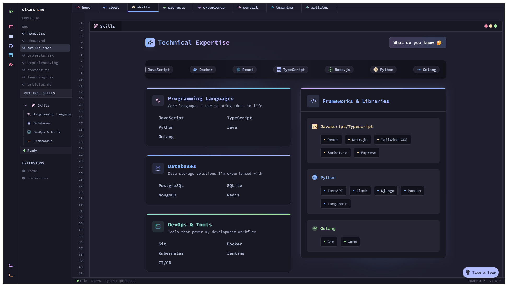
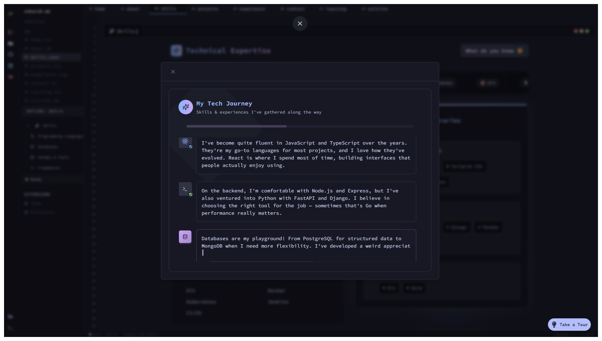
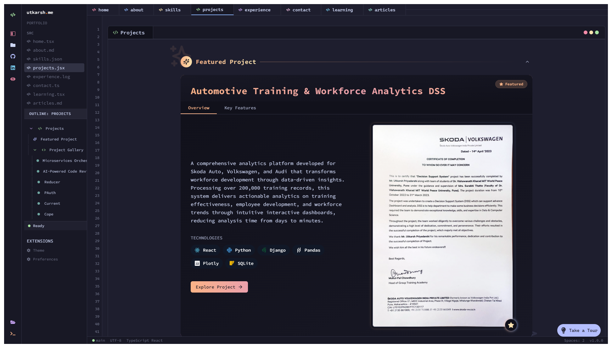
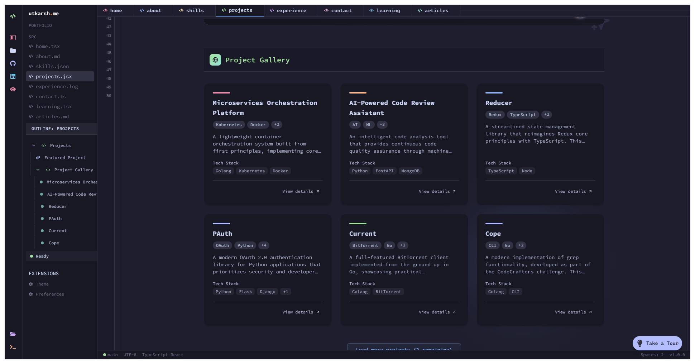

# Utkarsh Priyadarshi

<div align="center">
  <p><em>Software Developer · Open Source Enthusiast</em></p>

  <a href="https://utkarsh5026.github.io/">
    
  </a>
  &nbsp;
  <a href="https://github.com/utkarsh5026/portfolio">
    
  </a>
  &nbsp;
  
  &nbsp;
  
  &nbsp;
  
</div>

---

A VS Code–inspired developer portfolio built with React, TypeScript, and Tailwind CSS. Features a fully interactive code editor UI, custom terminal, smooth animations, and a 3D scene — all wrapped in the Catppuccin Mocha color palette.

## Preview











## Features

- **VS Code UI** — File explorer, draggable tabs, status bar, and a toggleable terminal (`` Ctrl+` ``)
- **Interactive Terminal** — Custom commands: `help`, `about`, `projects`, `skills`, `contact`
- **3D Visuals** — Three.js scene integrated into the portfolio
- **Data Visualizations** — D3-powered charts for skills and tech journey sections
- **Rich Animations** — Framer Motion, GSAP, and AnimeJS for fluid, layered transitions
- **Project Showcase** — Cards with descriptions, tech tags, GitHub links, and live demos
- **Articles Section** — Highlights technical writing and blog posts
- **Responsive & Accessible** — Works across all screen sizes; built on Radix UI primitives
- **Dark Theme** — Catppuccin Mocha palette throughout
- **PWA Ready** — Configured with `vite-plugin-pwa` for installability and offline support

## Tech Stack

### Core

| Layer | Technology |
| --- | --- |
| UI Framework | React 18.3 + TypeScript |
| Build Tool | Vite 5 |
| Styling | Tailwind CSS 3 |
| Routing | React Router DOM 7 |
| State | Zustand |

### UI & Components

| Purpose | Library |
| --- | --- |
| Headless Primitives | Radix UI (Dialog, Tabs, Tooltip, Dropdown, …) |
| Component System | shadcn/ui |
| Icons | Lucide React + React Icons |
| Drawer | Vaul |
| Resizable Panels | react-resizable-panels |

### Animations & 3D

| Purpose | Library |
| --- | --- |
| Declarative Animations | Framer Motion 12 |
| Timeline Animations | AnimeJS 3 |
| DOM Animations | GSAP 3 |
| 3D Rendering | Three.js + three-stdlib |
| Data Visualization | D3 7 |

## Project Structure

```text
app/src/
├── components/
│   ├── base/           # ThemeProvider, global wrappers
│   ├── home/
│   │   ├── about/      # About me section
│   │   ├── articles/   # Technical articles
│   │   ├── contact/    # Contact form & links
│   │   ├── editor/     # VS Code editor chrome (tabs, explorer, terminal)
│   │   ├── intro/      # Hero / introduction
│   │   ├── learning/   # Current learning section
│   │   ├── projects/   # Project cards & modals
│   │   ├── skills/     # Skills & D3 visualizations
│   │   └── work/       # Work experience timeline
│   ├── section/        # Shared section layout components
│   ├── ui/             # shadcn/ui components
│   └── utils/          # Shared utility components
├── lib/                # Helper functions
├── types/              # Global TypeScript types
└── App.tsx
```

## Getting Started

```bash
# Clone
git clone https://github.com/utkarsh5026/portfolio.git
cd portfolio/app

# Install
npm install

# Dev server → http://localhost:5173
npm run dev

# Production build
npm run build
```

## Deployment

Deployed on **GitHub Pages** at [utkarsh5026.github.io](https://utkarsh5026.github.io/).

## Contact

| Platform | Link |
| --- | --- |
| Email | [utkarshpriyadarshi5026@gmail.com](mailto:utkarshpriyadarshi5026@gmail.com) |
| GitHub | [@utkarsh5026](https://github.com/utkarsh5026) |
| LinkedIn | [Utkarsh Priyadarshi](https://www.linkedin.com/in/utkarsh-priyadarshi-8b5a731b9/) |
| Twitter / X | [@UtkarshPriyad10](https://x.com/UtkarshPriyad10) |

## License

MIT — open source and free to use.
